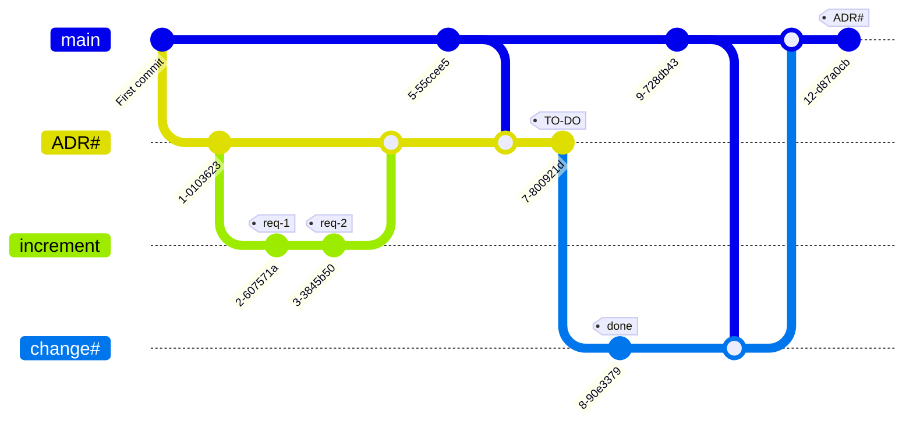

# CEAF-Changes
CEAF Changes - модуль управления изменениями, выделенный из ceaf-core-original
Создан на основе форка от [CEAF](https://github.com/rpiontik/ceaf-core-original.git). 


### Соглашение по идентификации архитектурных объектов

1. Идентификаторы должны соответствовать принципу DDD (структурированные идентифкаторы);
2. Используются только строчные символы;
3. Для разделения домена используется символ - "."
4. Для разделения слов - "_";
5. Системные идентификаторы должны начинаться с "$";
6. В идентификаторах могу быть использованы только символы - a..z 0..9 "_" "." "$";
7. Идентификаторы должны отражать смысл и быть существительным.

**RegEx для идентификаторов:** ^\[a-z0-9_\$]\[a-z0-9_\$]\*(\.\[a-z0-9_\$]\[a-z0-9_\$]\*)*$

Предлагается следующая структура идентификаторов:
```
[зона www].[домен].**
```

Примеры:
```
info.dochub.frontend
ru.nalog.site_fns
ru.yandex.app.search
```

## Процессы управления

Использование систем управления версиями положено в основу предлагаемых процессов. 

### Сегментация кодовой базы

Рекомендуется сегментировать кодовую базу в соответствии с логическими пространствами
доменов управления, придерживаясь принципов федеративного управления архитектурой.

Например, если вы практикуете микросервисную архитектуру, будет уместно выделить следующие сегменты
и разместить их в отдельных репозиториях:

1. **Metamodel** - стандартизированная метамодель, которую будут использовать и развивать все команды;
2. **General** - репозиторий обобщающий информацию о всех микросервисах и представляющий их как систему
   для нужд всех команд;
3. **TeamN** - репозиторий команды, в котором она развивает архитектуру микросервисов.

Такое разделение позволит минимизировать информационный шум для участников архитектурных преобразований,
а также настроить ролевую модель.

Для удобства разработчиков, архкод развиваемый командой, допускается расположить непосредственно в 
репозиториях микросервисов.


Связать репозитории и представить их в едином интерфейсе позволит референсный инструмент -
[DocHub](https://dochub.info/)

### Развитие архкода

В качестве целей развития архкода рассматривается :
1. Проектирование и планирование архитектурных изменений (to-be);
2. Фиксация и документирование состоявшихся изменений (as-is).

Для реализации этих целей предлагается следующий процесс: 



Здесь ветка **"main"** отражает "как есть", т.е. представление о том, какая архитектура
имеется на текущий момент.

При необходимости архитектурных преобразований, создается ветка **ADR (Architecture Decision Record)**.
Первоначально в ветке отражается суть преобразований. Т.е. регистрируется сам ADR.

ADR подразумевает одно преобразование или их комплекс. Каждое целевое преобразование
оформляется как архитектурный инкремент - **Increment**.

Increment отщипывается от ветки ADR и развивается в соответствии с требованиями по
преобразованию. При завершении имплементации требования, комит тегируется 
исполненным требованием. Это делается для удобства контроля полноты реализации
ADR, а также позволяет локализовывать сегмент архкода отвечающий за них.

По завершению наполнения инкремента, он вливается в ветку ADR.

Когда ветка ADR скомплектована, она тегируется к реализации **"to-do"**.

Готовые к реализации ADR берутся в работу. Для этого от ADR отщипывается ветка
**"change"**. В ходе реализации ветки, допускается детализация архкода без 
противоречия сути ADR.

После имплементации преобразований, ветка change вливается в main. 
Таким образом происходит актуализация архитектуры "как есть". Актуализация
тегируется исполненным ADR с целью контроля его реализации.

Если ADR оказывается слишком сложным (большим), необходимо его декомпозировать.
Для этого использовать подход структурирования идентификаторов. Например, ADR по 
созданию новой системы с номером ARD12 разделить на: ADR12.1; ADR12.2 и т.д.

Такая идентификация позволит не утерять смысл при чтении тегов и проще 
контролировать целостность преобразований.

__При развитии архкода, на постоянной основе, должна происходить синхронизация с веткой
main для актуализации знаний о реальной архитектуре с целью контроля реализуемости 
проектируемых изменений.__

### Федеративное управление архитектурой

CEAF рассматривает федеративное управление архитектурой как инструмент эффективного
управления архитектурой в сложных, неоднородных системах и системах с динамической
сложностью.

Федерация это совокупность доменов с автономным управлением связанная в систему
контрактами.

#### Домены управления

Для разделения на домены управления необходимо определить критерии. Для каждого 
случая они могут быть уникальными. Типовые:
* Организационная единица (департамент, управление, команда и т.д);
* Продуктовая единица (цифровой продукт, вертикаль и т.д.);
* Сервисная единица (сервис авторизации, сервис оплаты и т.д.).

При выделении домена необходимо стремиться к однородности процесса
управления архитектурой в нем. Признаками могут стать единые стандарты для
домена, технологический стек, единый релизный цикл и т.д.

Домену выделяется пространство имен, в котором он описывает архитектурные объекты 
и специфичную метамодель. 

Например:
- ru.company.it.auth.*
- ru.company.product1.*  


## Лицензия

Распространяется под лицензией Apache License 2.0 Open source license.


