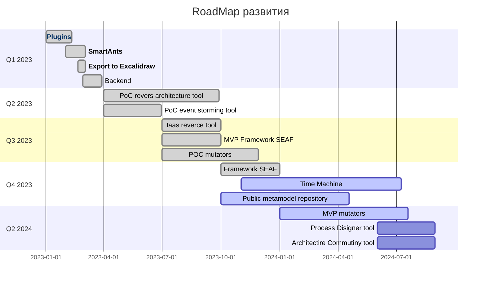

## Roadmap

```mermaid
gantt
    title RoadMap развития
    dateFormat  YYYY-MM
    section Q1 2023
        Plugins                      :done, plugins, 2023-01-01, 40d
        SmartAnts                    :done, smartants, 2023-02-01, 30d
        Export to Excalidraw         :done, exportexc, 2023-02-20, 11d
        Backend                      :done, 2023-02-27, 30d
    section Q2 2023
        PoC revers architecture tool    :done, 2023-04-01, 180d
        PoC event storming tool         :done, 2023-04-01, 90d
    section Q3 2023
        Iaas reverce tool           :done, 2023-07-01, 92d
        MVP Framework SEAF          :done, 2023-07-01, 92d
        POC mutators                :done, 2023-07-01, 150d
    section Q4 2023
        Framework SEAF              :done, 2023-10-01, 92d
        Time Machine                :active, 2023-11-01, 250d
        Public metamodel repository :active, 2023-10-01, 200d
    section Q2 2024
        MVP mutators                :active, 2024-01-01, 200d
        Process Disigner tool       :2024-06-01, 90d
        Architectire Commutiny tool :2024-06-01, 90d

click plugins href "https://dochub.info/docs/dochub.plugins.intro"
click smartants href "https://dochub.info/docs/dochub.smartants"
click exportexc href "https://dochub.info/docs/dochub.smartants#%D0%BF%D1%80%D0%BE%D1%81%D1%82%D0%B5%D0%B9%D1%88%D0%B5%D0%B5-%D0%BF%D1%80%D0%B5%D0%B4%D1%81%D1%82%D0%B0%D0%B2%D0%BB%D0%B5%D0%BD%D0%B8%D0%B5"
```

## Releases